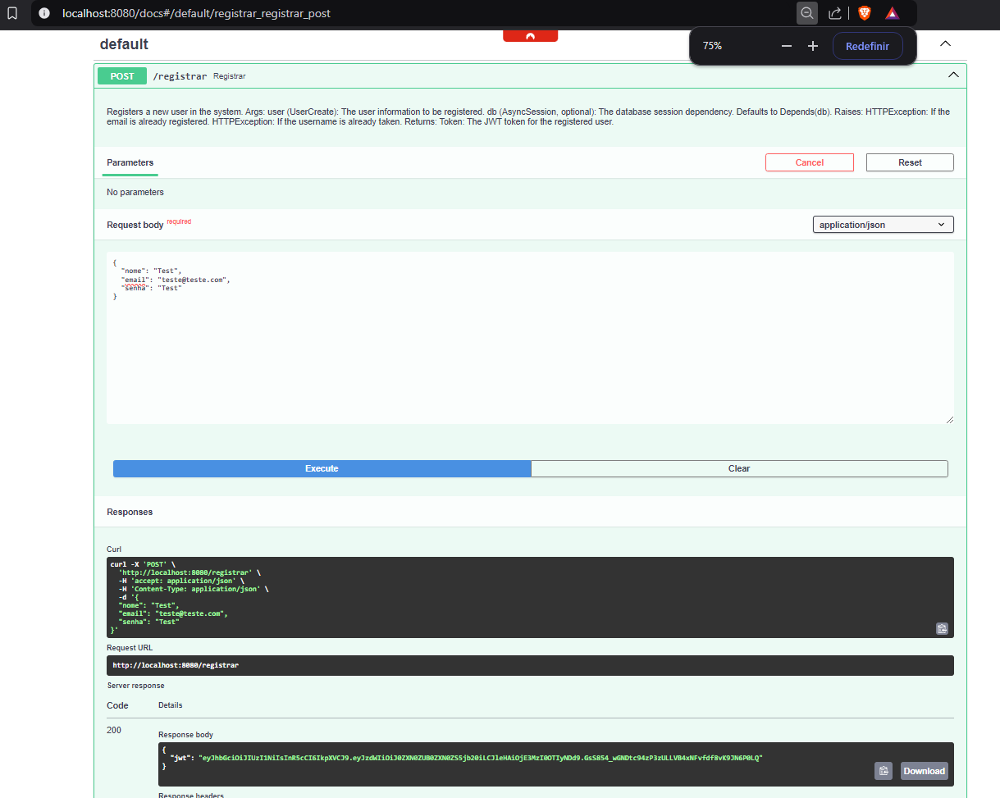
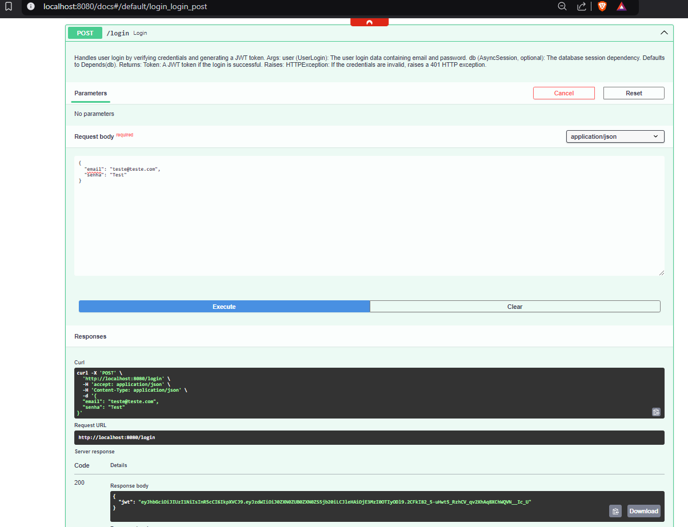

# Projeto de Computação Embarcada

Este projeto é uma API FastAPI para manipulação de usuários e consulta de dados do jogo Grepolis.

## Dados

A aplicação permite a consulta de dados dos jogadores do jogo Grepolis. Esses dados são obtidos através de endpoints específicos do Grepolis e são combinados em um DataFrame para facilitar a manipulação e exibição, atualizados em hora em hora.

## Endpoints

### Registrar Usuário

- **URL:** `/registrar`
- **Método:** `POST`
- **Descrição:** Registra um novo usuário no banco de dados.
- **Parâmetros:**
  - `user` (UserCreate): Informações do usuário a ser registrado.
- **Retorno:**
  - `Token`: O token JWT para o usuário registrado.
- **Erros:**
  - `400`: Email já registrado.
  - `400`: Nome indisponível.

### Login

- **URL:** `/login`
- **Método:** `POST`
- **Descrição:** Lida com o login do usuário, verificando as credenciais e gerando um token JWT.
- **Parâmetros:**
  - `user` (UserLogin): Dados de login do usuário contendo email e senha.
- **Retorno:**
  - `Token`: Um token JWT se o login for bem-sucedido.
- **Erros:**
  - `401`: Credenciais inválidas.

### Consultar Dados

- **URL:** `/consultar`
- **Método:** `GET`
- **Descrição:** Valida um token e retorna os dados dos jogadores do Grepolis em formato HTML.
- **Parâmetros:**
  - `payload` (dict): O token a ser validado. Este é fornecido pela dependência `Depends(validate_token)`.
- **Retorno:**
  - `HTMLResponse`: Contém os dados dos jogadores do Grepolis em formato HTML.
- **Erros:**
  - `403`: Token inválido ou expirado.

## Modelos

### UserCreate

- **Descrição:** Modelo Pydantic usado para criar um novo usuário.
- **Atributos:**
  - `nome` (str): Nome do usuário.
  - `email` (str): Endereço de email do usuário.
  - `senha` (str): Senha do usuário.

### UserLogin

- **Descrição:** Modelo Pydantic para informações de login do usuário.
- **Atributos:**
  - `email` (str): Endereço de email do usuário.
  - `senha` (str): Senha do usuário.

### Token

- **Descrição:** Modelo representando um JSON Web Token (JWT).
- **Atributos:**
  - `jwt` (str): O token JWT como uma string.

# Imagem Docker

Disponível em: [peng1104/projeto_cloud](https://hub.docker.com/r/peng1104/projeto_cloud)

# Como executar

1. Crie um arquivo `docker-compose.yml` com o seguinte conteúdo:
    ```yaml
    services:
      app:
        image: peng1104/projeto_cloud:v1.0.1
        ports:
          - "8080:8080"
        volumes:
          - ./app:/app
        env_file:
          - .env
        depends_on:
          - database

      database:
        image: postgres:latest
        restart: always
        env_file:
          - .env
        volumes:
          - postgres-data:/var/lib/postgresql/data

    volumes:
      postgres-data:
    ```
2. Configure as variáveis de ambiente no arquivo `.env`. Exemplo:
    ```env
    POSTGRES_USER=humberto
    POSTGRES_PASSWORD=gabriela
    POSTGRES_DB=db_app
    POSTGRES_PORT=5432

    APP_PORT=8080
    JWT_SECRET=750fc55c0a404f8485580fd4bbcf6d7e
    ```
3. Execute a aplicação:
    ```sh
    docker run --env-file .env -p 8080:8080 peng1104/projeto_cloud:v1.0.1
    ```

## Docker

Você também pode executar a aplicação usando Docker:

1. Construa a imagem Docker:
    ```sh
    docker build -t projeto_cloud .
    ```
2. Execute os containers usando Docker Compose:
    ```sh
    docker-compose up
    ```

## Publicação no Docker

Para publicar a imagem no Docker Hub, foi ultilizados os sequintes comandos:

1. Faça login no Docker Hub:
  ```sh
  docker login
  ```

2. Construa a imagem Docker:
  ```sh
  docker build -t peng1104/projeto_cloud:v1.0.1 .
  ```

3. Faça o push da imagem para o Docker Hub:
  ```sh
  docker push peng1104/projeto_cloud:v1.0.1
  ```

Certifique-se de substituir `seu_usuario_docker` pelo seu nome de usuário no Docker Hub.


## Screenshots dos Endpoints

### Tela de Registro


### Tela de Login


### Tela de Consulta


## Video demonstrativo

[Assista ao vídeo demonstrativo aqui](https://youtu.be/rpISwUK8aME)

## Aluno

Lucas Hix